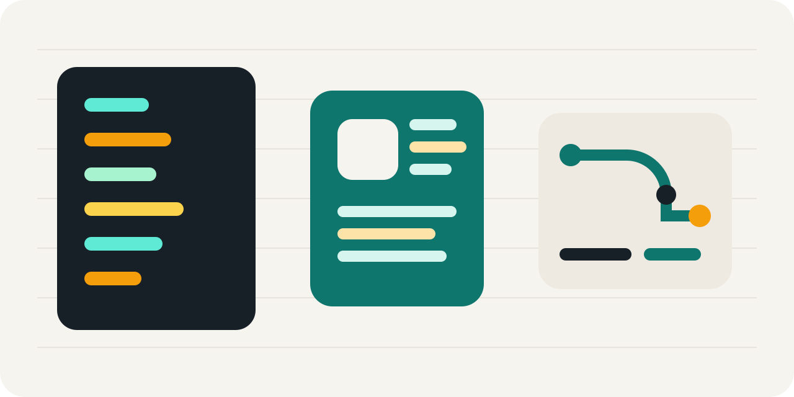

<div align="center">
  
  <h1>Proxmox Skill</h1>
  <p><strong>Safe, public-ready Proxmox VE automation for Codex.</strong></p>
  <p>
    Inspect clusters, start guests, create VMs, clone templates, and provision LXC containers
    through a reusable <code>uv run</code> helper script and a focused Codex skill.
  </p>
  <p>
    
    
    
    
  </p>
  <p>
    <a href="./README.md"><strong>English</strong></a>
    ·
    <a href="./README.ja.md"><strong>日本語</strong></a>
  </p>
</div>

<p align="center">
  
</p>

## ✨ Highlights

- Use a single skill folder to drive both Codex instructions and a real Proxmox VE API client.
- Keep credentials in a local `.env` file while publishing only `.env.example`.
- Support QEMU VM inspection, start, create, and clone workflows.
- Support LXC inspection, create, and start workflows.
- Normalize `root` to `root@pam`, manage ticket authentication, and attach CSRF headers automatically.
- Stay dependency-light: the helper uses Python standard library APIs and runs with `uv run`.

## 🚀 Quick Start

1. Clone the repository.
2. Copy `.env.example` to `.env`.
3. Fill in your Proxmox host, username, and password.
4. Run inspection commands before any mutating operation.

```powershell
Copy-Item .env.example .env
uv run .\scripts\proxmox_vm.py nodes
uv run .\scripts\proxmox_vm.py nextid
uv run .\scripts\proxmox_vm.py list-vms --node pve
uv run .\scripts\proxmox_vm.py list-cts --node pve
```

PowerShell users can keep the `.\scripts\...` form. On other shells, `./scripts/proxmox_vm.py` works the same way.

## 🧠 Skill Entry Point

The Codex skill definition lives in [SKILL.md](./SKILL.md). It documents the recommended inspection-first workflow, safe `.env` handling, and examples for:

- starting an existing VM
- creating a blank VM shell
- cloning from an existing VM template
- creating and starting an LXC container

The helper implementation lives in [scripts/proxmox_vm.py](./scripts/proxmox_vm.py), and lower-level command notes live in [references/api-notes.md](./references/api-notes.md).

## 🧪 Sample Scripts

The repository now includes reusable sample scripts under [scripts/examples/](./scripts/examples/) so the inspection helpers used during validation are packaged with the repo instead of living only in ad-hoc shell history.

Probe a cluster and one node:

```powershell
uv run .\scripts\examples\cluster_probe.py --node pve --content-storage local
```

Capture a guest status/config snapshot:

```powershell
uv run .\scripts\examples\guest_snapshot.py --kind lxc --node pve --vmid 230
```

These examples are intentionally non-destructive and are meant to be copied, adapted, or extended before you automate mutating operations.

## 🛠️ Common Commands

Inspect nodes:

```powershell
uv run .\scripts\proxmox_vm.py nodes
```

Create a VM shell:

```powershell
uv run .\scripts\proxmox_vm.py create `
  --node pve `
  --vmid 220 `
  --name app-220 `
  --memory 4096 `
  --cores 4 `
  --bridge vmbr0 `
  --storage local-lvm `
  --disk-gb 32 `
  --wait
```

Clone from a template:

```powershell
uv run .\scripts\proxmox_vm.py clone `
  --node pve `
  --source-vmid 9000 `
  --newid 221 `
  --name app-221 `
  --full `
  --wait
```

Create and boot an LXC container:

```powershell
uv run .\scripts\proxmox_vm.py create-ct `
  --node pve `
  --vmid 230 `
  --hostname codex-230 `
  --ostemplate local:vztmpl/ubuntu-24.04-standard_24.04-2_amd64.tar.zst `
  --storage local-lvm `
  --memory 512 `
  --swap 512 `
  --cores 1 `
  --disk-gb 8 `
  --bridge vmbr0 `
  --ip dhcp `
  --wait `
  --start-after-create
```

## 🔐 Safety Model

- Read `.env` from disk instead of shell-sourcing it.
- Keep `.env` ignored and publish only `.env.example`.
- Inspect the target node, VM ID, storage, bridge, and template before mutating.
- Prefer `--wait` when you need the actual task result instead of a queued task ID.
- Avoid hard-coding local cluster names into your own automation; use placeholders or environment-driven values.

## 🧪 Validation Status

This repository has been exercised against a live Proxmox VE environment for the LXC path:

- inspect nodes and existing guests
- allocate the next free ID
- create an LXC container from a Proxmox template
- start the created container
- confirm `running`
- stop the same container and confirm `stopped`

The public docs intentionally omit host-specific identifiers while keeping the workflow reproducible.

## 📚 Documentation

- Docs site source: [docs/](./docs/)
- English guide entry: [docs/guide/getting-started.md](./docs/guide/getting-started.md)
- Japanese guide entry: [docs/ja/guide/getting-started.md](./docs/ja/guide/getting-started.md)
- GitHub Pages target: `https://sunwood-ai-labs.github.io/proxmox-skill/`

## 🗂️ Repository Layout

```text
.
|-- SKILL.md
|-- scripts/
|   |-- examples/
|   |   |-- cluster_probe.py
|   |   `-- guest_snapshot.py
|   `-- proxmox_vm.py
|-- references/
|   `-- api-notes.md
|-- docs/
|   |-- .vitepress/
|   |-- guide/
|   `-- ja/
|-- agents/
|   `-- openai.yaml
|-- .env.example
`-- pyproject.toml
```

## 📄 License

Released under the [MIT License](./LICENSE).
